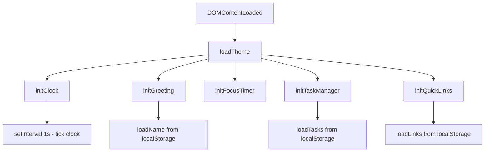
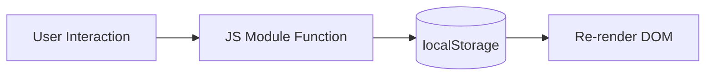

# Design Document: To-Do List Life Dashboard

## Overview

The To-Do List Life Dashboard is a single-page, client-side web application built with vanilla HTML, CSS, and JavaScript. It runs entirely in the browser with no backend, no build tools, and no external dependencies. All data is persisted via the browser's `localStorage` API.

The application is structured as three files:
- `index.html` — markup and structure
- `css/style.css` — all styling, including light/dark themes and responsive layout
- `js/app.js` — all application logic

The dashboard presents four functional widgets in a card-based layout on a purple/blue gradient background:
1. **Clock & Greeting** — live time/date display with a personalized salutation
2. **Focus Timer** — a 25-minute Pomodoro countdown
3. **Task Manager** — a persistent to-do list with add, edit, complete, sort, and delete
4. **Quick Links** — a saved-URL launcher

---

## Architecture

The application follows a simple **module pattern** inside a single `app.js` file. There is no framework, no bundler, and no module system — everything runs in a single browser script scope, organized into clearly named function groups.

```
index.html
  └── css/style.css        (all styles, CSS custom properties for theming)
  └── js/app.js            (all logic, organized by feature module)
```

### Initialization Flow



Theme is loaded first (before any rendering) to prevent a flash of the wrong theme.

### Data Flow

All state lives in `localStorage`. There is no in-memory global state store — each module reads from and writes to `localStorage` directly, with a thin wrapper that handles unavailability gracefully.



---

## Components and Interfaces

### Storage Module

A thin wrapper around `localStorage` that catches errors and surfaces a non-blocking warning.

```javascript
// storage.js (inlined in app.js)
const Storage = {
  get(key, fallback = null),
  set(key, value),          // JSON.stringify internally
  remove(key),
  isAvailable()             // returns boolean
};
```

**Keys used:**

| Key                    | Value type       | Description                        |
|------------------------|------------------|------------------------------------|
| `tld_theme`            | `"light"/"dark"` | Active theme                       |
| `tld_name`             | `string`         | User's display name                |
| `tld_tasks`            | `Task[]` (JSON)  | Ordered array of task objects      |
| `tld_links`            | `Link[]` (JSON)  | Ordered array of quick-link objects|

---

### Clock & Greeting Component

**Responsibilities:** Display current time (HH:MM:SS), current date (human-readable), and a time-of-day greeting with optional user name.

**DOM elements:**
- `#clock-time` — time display
- `#clock-date` — date display
- `#greeting-text` — greeting salutation
- `#name-input` — text input for user name
- `#name-save-btn` — save button

**Functions:**
```javascript
initClock()           // starts setInterval(tickClock, 1000)
tickClock()           // updates #clock-time and #clock-date
initGreeting()        // loads name, renders greeting
getGreetingPhrase(hour: number): string  // pure function
renderGreeting(name: string)
saveName()            // reads input, persists, re-renders
```

**Greeting logic:**

| Hour range  | Phrase          |
|-------------|-----------------|
| 05:00–11:59 | Good Morning    |
| 12:00–17:59 | Good Afternoon  |
| 18:00–21:59 | Good Evening    |
| 22:00–04:59 | Good Night      |

---

### Focus Timer Component

**Responsibilities:** 25-minute countdown with Start, Stop, and Reset controls. Notifies user on completion.

**DOM elements:**
- `#timer-display` — MM:SS countdown
- `#timer-start` — Start button
- `#timer-stop` — Stop button
- `#timer-reset` — Reset button

**State (module-level variables):**
```javascript
let timerInterval = null;   // setInterval handle or null
let timerSeconds = 1500;    // remaining seconds (default 25 * 60)
```

**Functions:**
```javascript
initFocusTimer()
startTimer()
stopTimer()
resetTimer()
tickTimer()                 // decrements timerSeconds, updates display
formatTime(seconds: number): string   // pure function → "MM:SS"
updateTimerControls()       // enables/disables Start and Stop buttons
notifyTimerComplete()       // alert or visual/audio signal
```

---

### Task Manager Component

**Responsibilities:** Add, display, edit, complete, delete, and sort tasks. Persists to `localStorage`.

**DOM elements:**
- `#task-input` — new task text input
- `#task-add-btn` — Add button
- `#task-error` — inline validation message
- `#task-list` — `<ul>` containing task items
- `#task-sort-btn` — Sort toggle button

**State:**
```javascript
let tasks = [];             // Task[] loaded from localStorage
let sortAscending = true;   // sort direction toggle
```

**Functions:**
```javascript
initTaskManager()
loadTasks(): Task[]
saveTasks()
renderTasks()
addTask()
editTask(id: string)
confirmEdit(id: string, newText: string)
toggleComplete(id: string)
deleteTask(id: string)
sortTasks()
validateTaskText(text: string): boolean   // pure function
```

---

### Quick Links Component

**Responsibilities:** Add, display, open, and remove quick-link buttons. Persists to `localStorage`.

**DOM elements:**
- `#link-name-input` — link display name input
- `#link-url-input` — URL input
- `#link-add-btn` — Add Link button
- `#link-error` — inline validation message
- `#links-container` — container for link buttons

**Functions:**
```javascript
initQuickLinks()
loadLinks(): Link[]
saveLinks()
renderLinks()
addLink()
removeLink(id: string)
normalizeUrl(url: string): string   // pure function — prepends https:// if needed
validateLink(name: string, url: string): boolean   // pure function
```

---

### Theme Module

**Responsibilities:** Toggle light/dark theme, persist preference, apply on load before render.

**DOM elements:**
- `#theme-toggle` — toggle button (always visible)

**Functions:**
```javascript
loadTheme()           // reads localStorage, applies data-theme attribute
toggleTheme()
applyTheme(theme: "light" | "dark")
```

**Implementation:** Theme is applied by setting `data-theme="dark"` on `<html>`. CSS custom properties switch all colors based on this attribute.

---

## Data Models

### Task

```javascript
{
  id: string,          // crypto.randomUUID() or Date.now().toString()
  text: string,        // task description (non-empty, trimmed)
  completed: boolean,  // completion state
  createdAt: number    // Unix timestamp ms (for stable sort fallback)
}
```

### Link

```javascript
{
  id: string,          // crypto.randomUUID() or Date.now().toString()
  name: string,        // display label (non-empty, trimmed)
  url: string          // normalized URL (always starts with http:// or https://)
}
```

### Storage Schema

All values are JSON-serialized. Example `localStorage` state:

```json
{
  "tld_theme": "dark",
  "tld_name": "Alex",
  "tld_tasks": [
    { "id": "1720000000000", "text": "Buy groceries", "completed": false, "createdAt": 1720000000000 }
  ],
  "tld_links": [
    { "id": "1720000001000", "name": "GitHub", "url": "https://github.com" }
  ]
}
```

---

## Correctness Properties

*A property is a characteristic or behavior that should hold true across all valid executions of a system — essentially, a formal statement about what the system should do. Properties serve as the bridge between human-readable specifications and machine-verifiable correctness guarantees.*

### Property 1: Greeting phrase covers all hours

*For any* integer hour value in [0, 23], `getGreetingPhrase(hour)` SHALL return exactly one of "Good Morning", "Good Afternoon", "Good Evening", or "Good Night", and the mapping SHALL be exhaustive with no hour left unclassified.

**Validates: Requirements 2.1, 2.2, 2.3, 2.4**

---

### Property 2: Timer format is always valid MM:SS

*For any* integer number of seconds in [0, 1500], `formatTime(seconds)` SHALL return a string matching the pattern `MM:SS` where MM is zero-padded minutes and SS is zero-padded seconds, and the total seconds encoded SHALL equal the input.

**Validates: Requirements 3.1, 3.3**

---

### Property 3: Non-empty task text is accepted; whitespace-only is rejected

*For any* string, `validateTaskText(text)` SHALL return `true` if and only if the trimmed string has length ≥ 1. Strings composed entirely of whitespace characters SHALL be rejected.

**Validates: Requirements 4.2, 4.3, 5.4**

---

### Property 4: Task addition round-trip

*For any* valid task description, after calling `addTask()` with that description, the task list retrieved from `localStorage` SHALL contain an entry whose `text` equals the trimmed description.

**Validates: Requirements 4.2, 4.4, 4.5**

---

### Property 5: Task completion toggle is idempotent in pairs

*For any* task, toggling its completion state twice SHALL return the task to its original completion state.

**Validates: Requirements 6.1, 6.2**

---

### Property 6: Sort produces a valid ordering

*For any* non-empty task list, after calling `sortTasks()` once, the resulting list SHALL be in ascending alphabetical order by `text`. After calling `sortTasks()` a second time, the list SHALL be in descending alphabetical order.

**Validates: Requirements 7.1, 7.2, 7.3**

---

### Property 7: URL normalization always produces an absolute URL

*For any* non-empty string input to `normalizeUrl()`, the returned string SHALL begin with either `"http://"` or `"https://"`. If the input already begins with one of those prefixes, it SHALL be returned unchanged.

**Validates: Requirements 8.4**

---

### Property 8: Link validation rejects empty fields

*For any* pair of (name, url) strings, `validateLink(name, url)` SHALL return `false` if either the trimmed name or the trimmed url is empty, and `true` only when both are non-empty.

**Validates: Requirements 8.3**

---

### Property 9: localStorage serialization round-trip

*For any* valid `Task[]` or `Link[]` array, calling `Storage.set(key, value)` followed by `Storage.get(key)` SHALL return a value that is deeply equal to the original array.

**Validates: Requirements 11.1, 11.2**

---

## Error Handling

### localStorage Unavailability

`Storage.isAvailable()` is called once on init. If `localStorage` is unavailable (e.g., private browsing with storage blocked, or quota exceeded), a non-blocking banner is shown:

```
⚠ Storage unavailable — your data will not be saved this session.
```

The application continues to function in-memory for the current session.

### Input Validation

- **Task input**: Empty or whitespace-only text shows an inline `#task-error` message. The error clears on the next valid submission or when the input changes.
- **Link input**: Empty name or URL shows an inline `#link-error` message. Invalid URLs are normalized rather than rejected (per Requirement 8.4).

### Timer Edge Cases

- Calling `startTimer()` while the timer is already running is a no-op (Start button is disabled while running).
- `resetTimer()` calls `clearInterval()` safely regardless of whether a timer is active.

### Theme Flash Prevention

`loadTheme()` is called synchronously in a `<script>` tag in `<head>` (before `<body>` renders) to apply `data-theme` before any content is painted.

---

## Testing Strategy

Because this feature is a vanilla JS single-page application with no build tooling, the testing approach is pragmatic and manual-first, with pure functions being the primary candidates for automated testing.

### PBT Applicability Assessment

Several pure functions in this application are well-suited for property-based testing:
- `getGreetingPhrase(hour)` — pure, finite input domain
- `formatTime(seconds)` — pure, bounded integer input
- `validateTaskText(text)` — pure string predicate
- `normalizeUrl(url)` — pure string transformation
- `validateLink(name, url)` — pure predicate
- `Storage.get/set` — round-trip serialization

The UI interaction and DOM manipulation code is not suitable for PBT.

### Unit / Property Tests

Since there is no build tool or test runner configured, the pure functions can be extracted and tested in isolation using any lightweight test runner (e.g., copy-paste into a browser console, or a minimal Node.js test script).

**Recommended approach for property tests:** Use a lightweight PBT library such as [fast-check](https://github.com/dubzzz/fast-check) in a minimal Node.js test file (no bundler needed — `node --experimental-vm-modules` or a simple `<script type="module">` in a test HTML page).

Each property test should run a minimum of **100 iterations**.

Tag format for each test: `Feature: todo-life-dashboard, Property {N}: {property_text}`

| Property | Function under test       | Test type | Min iterations |
|----------|---------------------------|-----------|----------------|
| 1        | `getGreetingPhrase`       | Property  | 100            |
| 2        | `formatTime`              | Property  | 100            |
| 3        | `validateTaskText`        | Property  | 100            |
| 4        | `addTask` + localStorage  | Property  | 100            |
| 5        | `toggleComplete`          | Property  | 100            |
| 6        | `sortTasks`               | Property  | 100            |
| 7        | `normalizeUrl`            | Property  | 100            |
| 8        | `validateLink`            | Property  | 100            |
| 9        | `Storage.get/set`         | Property  | 100            |

### Example / Integration Tests

- Clock displays correct HH:MM:SS format (example test)
- Theme toggle switches `data-theme` attribute (example test)
- Dashboard loads without errors in Chrome, Firefox, Edge, Safari (manual smoke test)
- Dashboard opens correctly via `file://` protocol (manual smoke test)
- Responsive layout renders correctly at 320px, 768px, 1280px, 1920px (manual/visual test)

### Visual / Manual Tests

- Light and dark themes apply correct colors to all components
- Card layout matches the purple/blue gradient design reference
- No flash of wrong theme on load
- localStorage warning banner appears when storage is blocked
